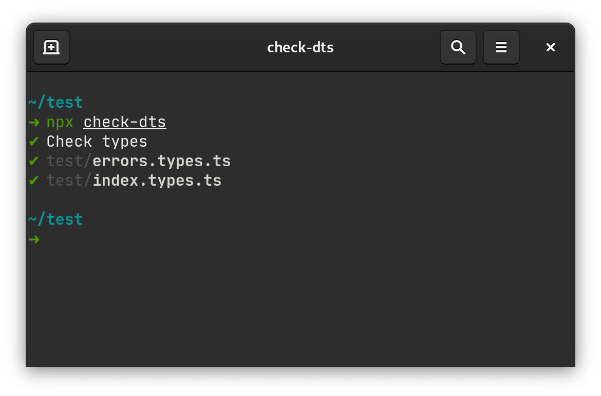

# Check TypeScript Definitions

Unit tests for `.d.ts` TypeScript definitions in your JavaScript
open source library.

It is useful for non-TypeScript project, which want to provide good typing
support for TypeScript users and good autocompletion for IDE and text editors.

It became especially useful if you have complex types with generics, like
we have in [Nano Events] or [Storeon].

```ts
// Negative test: test/index.errors.ts
import lib = require('../')

interface Events {
  'set': (a: string, b: number) => void
}
// THROWS Expected 3 arguments, but got 2
lib.on<Events>('set', 2)
```

```ts
// Positive test: test/index.types.ts
import lib = require('../')

interface Events {
  'set': (a: string, b: number) => void
}
lib.on<Events>('set', 'prop', 1)
```

[Nano Events]: https://github.com/ai/nanoevents/#typescript
[Storeon]: https://github.com/storeon/storeon#typescript



<a href="https://evilmartians.com/?utm_source=check-dts">
  
</a>

## Usage

1. Add `.d.ts` files with TypeScript definitions for your JS library.
   You can check example in
   [Nano Events](https://github.com/ai/nanoevents/blob/master/index.d.ts).
2. Install `check-dts`:

   ```sh
   npm install --save-dev check-dts
   ```

3. Create `test/index.types.ts` for positive tests and write correct TypeScript.
   You can test IDE autocompletion in that file.
4. Run `npx check-dts` to test new file.
5. Create `test/index.errors.ts` for negative tests and write wrong types there.
6. Run `npx check-dts` to test both files.
7. Add `check-dts` to `npm test` to test types on CI:

   ```diff
     "scripts": {
   -   "test": "jest && eslint ."
   +   "test": "jest && eslint . && check-dts
     }
   ```
